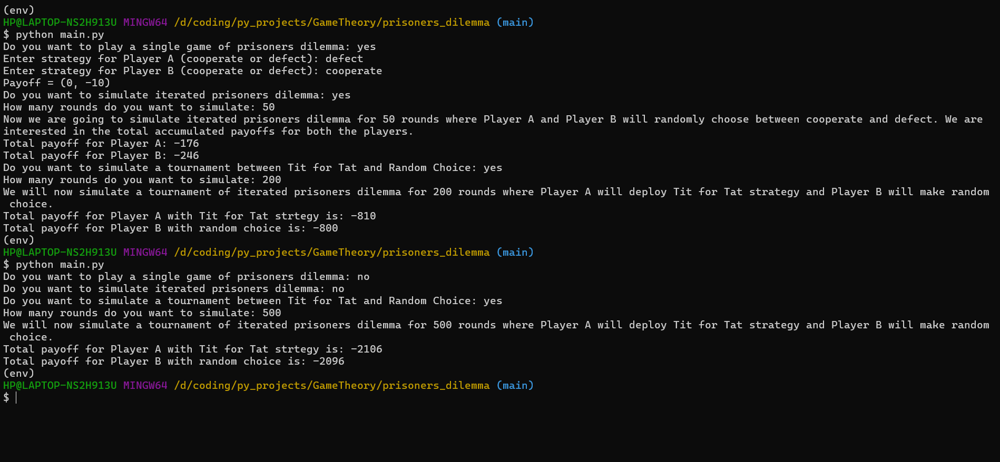

# Prisoners Dilemma

- play_game()
    - This function is a simulation of a single game of prisoners dilemma.
- iterated_prisoners_dilemma_with_random_choice()
    - In this function we simulate iterated prisoners dilemma between 2 players where they make random choices.
- TitForTat_vs_RandomPlayer()
    - In this function we simulate a tournament between two different strategies. Player A uses the Tit for Tat strategy where as Player B makes random choice.
- We also used the nashpy library and support enumeration function to calculate the nash equilibrium. We calculated the nash equilibrium for perfect strategy as well as mixed strategy games.

